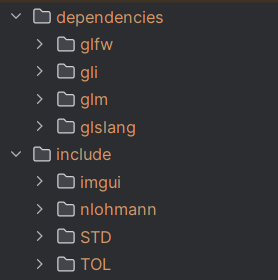

## 项目说明

通过学习本项目中包含的两本Vulkan相关的参考书——《Vulkan学习指南(王锐 译)》《Vulkan开发实战详解(吴亚峰)》及其示例代码，小伙伴们可以以相对平缓的学习曲线完成Vulkan入门到进阶阶段的学习。

**发行版中的epub文件仅供学习用途！**

## 本项目的内容包含

1. 《Vulkan学习指南(王锐 译)》(英文原书:《Learning Vulkan(Parminder Singh)》)的随书代码
2. 《Vulkan开发实战详解(吴亚峰)》的随书代码

## 开发环境以及项目依赖

* 独立显卡(可选项，支持的层和扩展更多)
* VS/CLion/VSCode
* VulkanSDK:1.3.290.0(安装时勾选glm)
* glfw:3.4
* glm:复制自vulkanSDK中的include文件夹
* glslang:在Github[仓库](https://github.com/KhronosGroup/glslang)选择与vulkanSDK版本匹配的1.3.290.0版本的分支并克隆到本项目的依赖文件夹内(在CMakeLists.txt中已经配置完毕)

## 注意事项

* 《Vulkan学习指南(王锐译)》部分
    * 代码位置：本项目中所有以`Basic`为前缀的文件夹内
* 《Vulkan开发实战详解》部分
    * 本仓库中包含的内容**仅包含**[原书附件示例代码](https://www.epubit.com/bookDetails?id=UB6c7827767c54a)中十九章之前的PC实例代码，如果了解安卓开发并想学习vulkan的小伙伴们建议同时参照原书的安卓版代码以及本仓库中的代码，避免Vulkan API过时。
    * 代码位置：本项目中所有以`Chapter`为前缀的文件夹内
    * 使用新开发环境、替换过时API、修复BUG并小幅重构后的可运行的代码。使用CMake构建。
    * 文件夹内的所有项目共用文件夹根目录的依赖
    * 仓库内上传了前18章的模型和纹理文件，但需要注意的是一个模型或纹理文件可能会被多个项目使用。第19章并没有整理，模型、纹理等资源文件在第19章的子目录中。
    * 本项目中的文件使用UTF8编码
    * 由于GLFW学习理解门槛相对较低，项目中使用GLFW代替了WIN32API实现窗口的创建以及外设输入处理

由于所有项目使用的物理设备均为物理设备列表中的第一个设备，需要使用设备的高级特性请调整选择的物理设备索引；当然这里也给出了使用Json配置GPU选择的一种方式：在仓库的根目录创建`config.json`文件

~~~json
{
  "GpuIndex": 0
}
~~~

然后在代码中使用：

~~~ c++
//头文件导入
#include <fstream>
#include <nlohmann/json.hpp>

//读取并输出json文件中键对应的值
std::ifstream f("../config.json");
json data = json::parse(f);
std::cout << data["GpuIndex"] << std::endl;
f.close();
~~~

## 代办列表：

* **重要**
    * 后续修复Basic_10b的校验层报错以及黑屏问题(注释掉着色器中使用pushConstant代码正常显示)
    * 后续修复16.02黑屏的问题
    * 后续修复17.07没有水面效果的问题
    * 后续修复18.5最小化窗口没问题，但是使用鼠标拖动窗口边缘会出现设备丢失的问题。
    * 找到为什么使用RenderDoc对进阶学习中的项目进行抓帧启动时会报错的原因(在Clion中可以运行，在文件管理器中双击打开报错 可能是缺库？)
    * 整理第19章内容

* **次要**
    * 后续修复Basic_7d的校验层报错
    * 后续修复Basic_7e的校验层报错
    * 后续修复Basic_8的校验层报错
    * 后续修复Basic_9a的校验层报错
    * 后续修复Basic_9b的校验层报错
    * 后续修复Basic_9c的校验层报错
    * 后续修复Basic_10a的校验层报错
    * 后续修复Basic_11a的校验层报错
    * 后续修复Basic_11b的校验层报错
    * 后续修复12.14关闭程序会报错`0xC0000374`的问题
    * 后续修复12.15关闭程序会报错`0xC0000374`的问题
    * 后续修复13.07关闭程序会报错`0xC0000374`的问题
    * 后续修复14.01关闭程序会报错`0xC0000374`的问题
    * 后续修复14.02关闭程序会报错`0xC0000374`的问题
    * 后续修复14.07关闭程序会报错`0xC0000374`的问题
    * 后续修复15.03关闭程序会报错`0xC0000374`的问题
    * 后续修复15.05关闭程序会报错`0xC0000374`的问题
    * 后续修复15.08关闭程序会报错`0xC0000374`的问题
    * 后续修复16.01关闭程序会报错`0xC0000374`的问题
    * 后续修复16.03关闭程序会报错`0xC0000374`的问题
    * 后续修复16.04关闭程序会报错`0xC0000374`的问题
    * 后续修复16.05关闭程序会报错`0xC0000374`的问题
    * 后续修复17.01关闭程序会报错`0xC0000374`的问题
    * 后续修复18.01关闭程序会报错`0xC0000374`的问题
    * 所有项目在改变窗口大小后都不能正确绘制(重建交换链)
    * 在完成18章的示例项目后给出一个集成[ImGui](https://github.com/ocornut/imgui),[Json](https://github.com/nlohmann/json)的三色三角形示例项目
    * 将上面一句话说明程序效果的文本作为所有示例项目的窗口标题

## 后记

1. 为了让书中使用glslang将glsl编译成spir-v的代码可用。使用SDK中的头和库文件编译后一直报错找不到符号，折腾了三四天翻了几十篇博客才搞定依赖并解决glsl编译成spirV代码
2. 报错`0xC0000374`:堆栈溢出（Stack Overflow）,可能是ObjObject::~ObjObject()中的`delete vdata;`而不是`delete[] vdata;`造成的
3. 《实战详解》里这么多有价值的代码不能运行我真是醉了 (눈‸눈)

